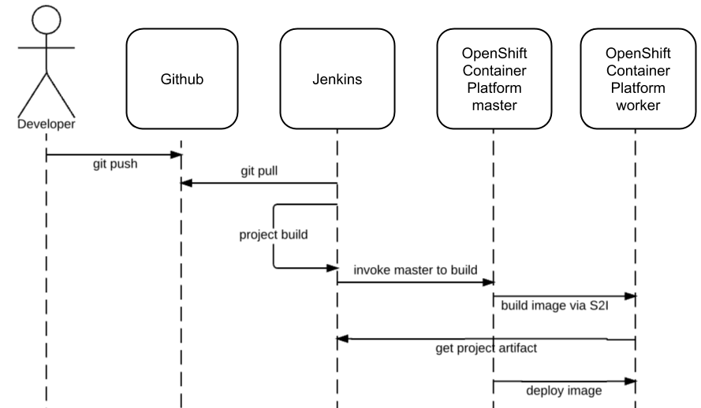

# DevOps project
### Jenkins Pipeline for Java based application using Maven, SonarQube, Argo CD, Helm and Kubernetes

### Architecture diagram

## Step-by-step details:

Prerequisites:

   -  Spring boot application code repository
   -  Jenkins server
   -  Kubernetes cluster
   -  Helm package manager
   -  Argo CD

### Architecture diagram

Steps:

    1. Install the necessary Jenkins plugins:
       1.1 Git plugin Version5.0.0
       1.2 Docker Pipeline
       1.3 Pipeline Maven Integration Plugin
       1.4 Pipeline: GitHub Groovy Libraries
       1.5 Pipeline plugin
       1.6 Kubernetes Continuous Deploy plugin
       1.7 SonarQube Scanner for Jenkins
       1.8 Sonar GerritVersion
       1.9 SonarQube Generic Coverage
       
    2. Jenkins shared libray: repo [link](https://github.com/yogeshk04/jenkins-shared-lib)
       2.1 Configure system
       2.2 Search for "Global Pipeline Libraries" option and add your library repo url

    3. Run doker container to configure sonar server
       3.1 docker run -d --name sonarqube -p 9000:9000 -p 9092:9092 sonarqube
       3.2 Login to sonarqube server and generate token - squ_72a03b879c6d2b381428335639ce5314c8440431 

    4. Create a new Jenkins pipeline:
       4.1 In Jenkins, create a new pipeline job and configure it with the Git repository URL for the Java application.
       4.2 Add a Jenkinsfile to the Git repository to define the pipeline stages.

    3. Define the pipeline stages:
        Stage 1: Checkout the source code from Git.
        Stage 2: Build the Java application using Maven.
        Stage 3: Run unit tests using JUnit and Mockito.
        Stage 4: Run SonarQube analysis to check the code quality.
        Stage 5: Package the application into a JAR file.
        Stage 6: Deploy the application to a test environment using Helm.
        Stage 7: Run user acceptance tests on the deployed application.
        Stage 8: Promote the application to a production environment using Argo CD.

    4. Configure Jenkins pipeline stages:
        Stage 1: Use the Git plugin to check out the source code from the Git repository.
        Stage 2: Use the Maven Integration plugin to build the Java application.
        Stage 3: Use the JUnit and Mockito plugins to run unit tests.
        Stage 4: Use the SonarQube plugin to analyze the code quality of the Java application.
        Stage 5: Use the Maven Integration plugin to package the application into a JAR file.
        Stage 6: Use the Kubernetes Continuous Deploy plugin to deploy the application to a test environment using Helm.
        Stage 7: Use a testing framework like Selenium to run user acceptance tests on the deployed application.
        Stage 8: Use Argo CD to promote the application to a production environment.

    5. Set up Argo CD:
        Stage 1: Install Argo CD on the Kubernetes cluster using operator [link](https://operatorhub.io/operator/argocd-operator)
        Stage 2: Got to https://argocd-operator.readthedocs.io/en/latest/usage/basics/
        Stage 3: Copy the code and create a manifest file to a new Argo CD cluster with the default configuration. 'Ref: k8s-manifests/argocd-basic.yaml'
        Stage 4: After this if you are using minikube user following command to port forward
            -> minikube service list 
         Or
            -> kubectl port-forward svc/example-argocd-server 8085:80        
        Stage 5: Open argocd using url: https://localhost:8085/
        Stage 6: Default username is admin
        Stage 7: For password use
            -> kubectl edit secret example-argocd-cluster and copy admin.password: cGtPUHExYWdMbzRYNnhZQlI5bnd1ajVmdHZabFRRS3I=
            -> echo -n 'cGtPUHExYWdMbzRYNnhZQlI5bnd1ajVmdHZabFRRS3I=' | base64 -d
      Node: Do not copy the last % symbol in password string
        Stage 8: Now copy the decrepted password and sign-in to Argo CD

    6. Configure Jenkins pipeline to integrate with Argo CD:
       6.1 Add the Argo CD API token to Jenkins credentials.
       6.2 Update the Jenkins pipeline to include the Argo CD deployment stage.

    7. Run the Jenkins pipeline:
       7.1 Trigger the Jenkins pipeline to start the CI/CD process for the Java application.
       7.2 Monitor the pipeline stages and fix any issues that arise.

This end-to-end Jenkins pipeline will automate the entire CI/CD process for a Java application, from code checkout to production deployment, using popular tools like SonarQube, Argo CD, Helm, and Kubernetes.
